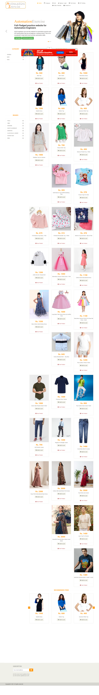
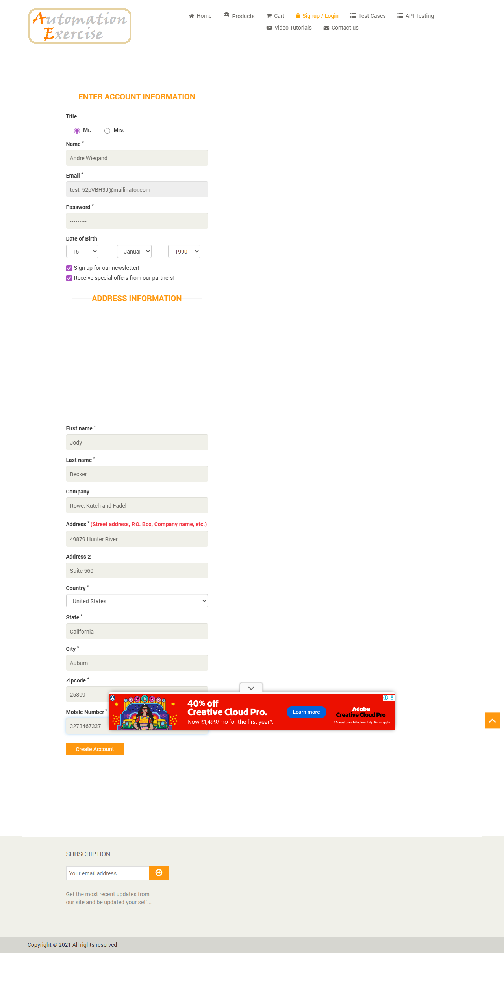
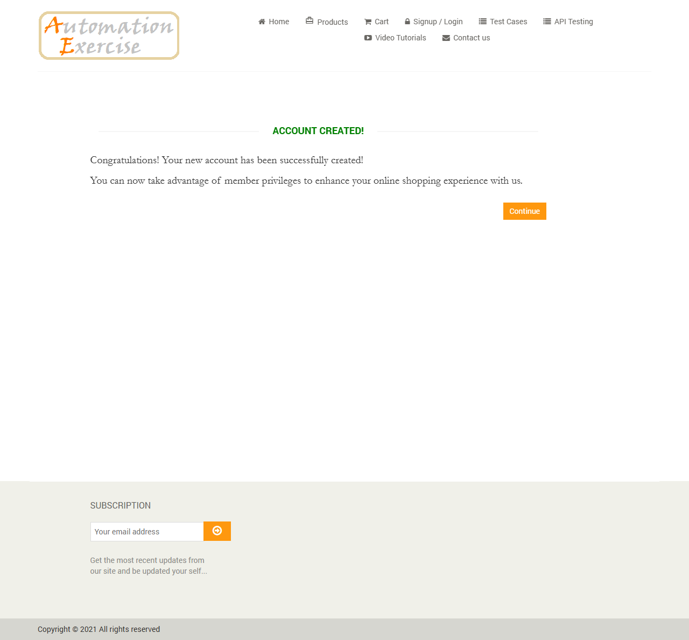

# 🎭 Playwright TypeScript POM + Data-Driven Framework
### AutomationExercise.com — Enterprise-Grade Test Automation

---

## 📋 Framework Overview

| Feature | Details |
|---|---|
| **Framework** | Playwright 1.42+ |
| **Language** | TypeScript (strict mode) |
| **Pattern** | Page Object Model (POM) |
| **Data Layer** | Excel (ExcelJS) + Faker.js |
| **Test Control** | Excel `Run (Y/N)` column |
| **Reporting** | Allure HTML Reports |
| **Browsers** | Chromium, Firefox, Safari, Mobile |

---

## 🏗️ Project Structure

```
d:\Learn_AI\POM\
├── src/
│   ├── pages/              # Page Object classes
│   │   ├── BasePage.ts     # Abstract base with reusable getByRole methods
│   │   ├── HomePage.ts
│   │   ├── LoginPage.ts
│   │   ├── SignupPage.ts
│   │   ├── ProductsPage.ts
│   │   ├── ProductDetailPage.ts
│   │   ├── CartPage.ts
│   │   ├── CheckoutPage.ts
│   │   ├── PaymentPage.ts
│   │   └── ContactUsPage.ts
│   ├── tests/              # Test specifications (TC001 - TC010)
│   ├── utils/              # Helper utilities
│   │   ├── ExcelHelper.ts  # Excel read/write + test control logic
│   │   ├── TestDataHelper.ts
│   │   ├── WaitHelper.ts
│   │   └── ScreenshotHelper.ts
│   ├── fixtures/
│   │   └── base.fixture.ts # Extended Playwright fixtures
│   ├── types/
│   │   └── TestData.types.ts
│   ├── data/
│   │   └── TestControl.xlsx  # Generated by setup script
│   └── scripts/
│       └── setupExcel.ts     # Excel generator
├── playwright.config.ts
├── tsconfig.json
├── package.json
└── .env
```

---

## 🚀 Quick Start

### 1. Install Dependencies
```bash
npm install
```

### 2. Install Playwright Browsers
```bash
npx playwright install
```

### 3. Generate Excel Test Control File
```bash
npm run setup:excel
```
> Opens `src/data/TestControl.xlsx` — set **Run = N** for any test you want to skip.

### 4. Update `.env` with credentials
```env
VALID_EMAIL=your_registered_email@example.com
VALID_PASSWORD=YourPassword123
```

---

## 🧪 Running Tests

| Command | Description |
|---|---|
| `npm test` | Run all tests (respects Excel control) |
| `npm run test:headed` | Run with visible browser |
| `npm run test:debug` | Run in debug mode |
| `npm run test:ui` | Playwright UI mode |
| `npx playwright test --project=chromium` | Chromium only |
| `npx playwright test TC003` | Run specific test file |

---

## 📊 Allure Reports

```bash
# Step 1: Run tests (generates allure-results/)
npm test

# Step 2: Generate HTML report
npm run allure:report

# Step 3: Open in browser
npm run allure:open

# OR: One command to serve live
npm run allure:serve
```

---

## 📌 Excel Test Control Sheet

Open `src/data/TestControl.xlsx` → **TestControl** sheet:

| TestID | TestName | **Run** | Priority | Tag |
|---|---|---|---|---|
| TC001 | Home Page Navigation | **Y** | High | smoke |
| TC002 | User Registration | **Y** | High | regression |
| TC003 | User Login - Valid | **Y** | High | smoke |
| TC004 | User Login - Invalid | **N** 🔴 | Medium | regression |
| ... | ... | ... | ... | ... |

- ✅ **Y (green)** = test will run
- ❌ **N (red)** = test will be **skipped**

No code changes needed — just edit the Excel file!

---

## 📸 Screenshots

### Home Page Loading (TC001)


### User Registration (TC002)


### Account Successfully Created


---

## 🧩 Key Framework Concepts

### Semantic Locators (getByRole)
```typescript
// Always preferred — resilient & accessible
page.getByRole('button', { name: 'Login' })
page.getByRole('link', { name: 'Products' })
page.getByRole('textbox', { name: 'Email Address' })
page.getByLabel('Password')
page.getByPlaceholder('Search Product')
```

### Excel-Driven Test Skip
```typescript
test.beforeEach(async () => {
  const shouldRun = await ExcelHelper.shouldRun('TC003');
  if (!shouldRun) test.skip(); // Skips gracefully with reason
});
```

### Allure Step Annotations
```typescript
await test.step('Verify login success', async () => {
  await homePage.assertRoleVisible('link', { name: ' Logout' });
  await ScreenshotHelper.captureAndAttach(page, 'Logged_In_State');
});
```

---

## 🧰 Test Cases

| ID | Test Name | Priority | Tag |
|---|---|---|---|
| TC001 | Home Page Navigation | 🔴 High | smoke |
| TC002 | User Registration | 🔴 High | regression |
| TC003 | User Login - Valid | 🔴 High | smoke |
| TC004 | User Login - Invalid | 🟡 Medium | regression |
| TC005 | Product Search | 🟡 Medium | regression |
| TC006 | Add Product to Cart | 🔴 High | smoke |
| TC007 | Checkout Flow (E2E) | 🔴 High | e2e |
| TC008 | Contact Us Form | 🟡 Medium | regression |
| TC009 | Email Subscription | 🟢 Low | regression |
| TC010 | Logout Flow | 🟡 Medium | smoke |

---

## 🌍 Multi-Browser Support

```bash
npx playwright test --project=chromium    # Chrome
npx playwright test --project=firefox     # Firefox
npx playwright test --project=webkit      # Safari
npx playwright test --project="Mobile Chrome"  # Pixel 5
```
